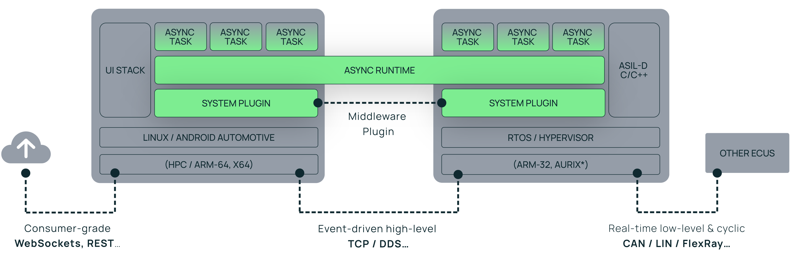

# Veecle

Our mission is to bridge the gap between existing supplier components and smart apps running on top through unified software framework. We provide a platform to tackle next-gen automotive connected & security demands.

### AURIX™ Rust Startup Ecosystem

The AURIX™ Rust Startup Ecosystem is a collaborative effort involving [Veecle](https://www.veecle.io), [Infineon](https://www.infineon.com), [HighTec](https://hightec-rt.com) and [Bluewind](https://www.bluewind.it) aimed at supporting Rust on Infineon's AURIX™ architecture for automotive and industrial applications.

Veecle contributes with two keys components to the ecosystem:

- [Veecle-pxros](https://github.com/veecle/veecle-pxros) A runtime for writing Rust applications on top of HighTec's safety kernel for the Infineon AURIX™ Platform.
- [Tricore-probe](https://github.com/veecle/tricore-probe): A tool that facilitates the flashing and debugging of Rust code on AURIX™ chips.

### Android Automotive support

We support [Android Automotive](aaos): this enables customers to develop safe and efficient interfaces to the vehicle. 

This is not public (yet). You can find information [here](aaos-plugin).

### Robot Operating System support

We integrate to the [Robot Operating System](ros) to allow for easy integration with enabled devices over the [Data Distribution Service](dds). 

This is not public (yet). You can find information [here](ros-plugin).

## About Veecle

Veecle sits between a legacy E/E architecture and modern UI and Cloud frameworks. Veecle abstracts an E/E architecture and provides unified control over it using a modern API. Veecle allows companies to develop "Apps" using unified APIs to interact with in-vehicle functions. An optional front-end framework is provided through Android Automotive support.

Our runtime seamlessly integrates across many ECUs — from infotainment systems to real-time controllers, playing together with existing and external services. The very same Rust code base can be compiled for Linux (e.g. Android Automotive) or as an isolated task on a real-time operating system (RTOS), ensuring *freedom from interference* on e.g. Infineon AURIX™ chips, or ARM embedded controllers.

### Get in touch

For licensing, demonstrations, or to learn more about **Veecle's Development Framework**, please reach out to us at [sales@veecle.io](mailto:sales@veecle.io) or visit our website at [veecle.io](https://www.veecle.io).

### Job offers

We are always open to have a chat with people interested in contributing or working with us. Please find our open applications [here](job).

[aaos]: https://source.android.com/docs/automotive/start/what_automotive
[aaos-plugin]: https://veecle.io/tech/aaos
[ros-plugin]: https://veecle.io/tech/dds
[ros]: https://www.ros.org
[dds]: https://www.dds-foundation.org/what-is-dds-3
[job]: https://veecle.io/company/hiring